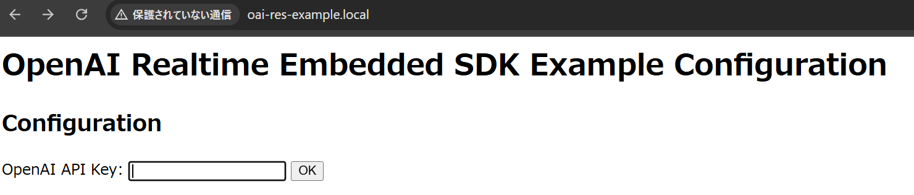

# Open RealtimeAPI Embedded SDK

# Table of Contents

- [Docs](#docs)
- [Installation](#installation)
- [Usage](#usage)

## Platform/Device Support

This SDK has been developed tested on a `esp32s3` and `linux`. You don't need any physical hardware
to run this SDK. You can use it from Linux directly.

To use it on hardware purchase either of these microcontrollers. Others may work, but this is what
has been developed against.

* [Freenove ESP32-S3-WROOM](https://www.amazon.com/gp/product/B0BMQ8F7FN)
* [Sonatino - ESP32-S3 Audio Development Board](https://www.amazon.com/gp/product/B0BVY8RJNP)

You can get a ESP32S3 for much less money on eBay/AliExpress.

## Installation

Select the target board.

* CoreS3 (SE) - `export SDKCONFIG_DEFAULTS="sdkconfig.defaults;sdkconfig.defaults.cores3"`
* AtomS3    (with Atomic Speaker and PDM Microphone Unit) - `export SDKCONFIG_DEFAULTS="sdkconfig.defaults;sdkconfig.defaults.atoms3"`
* Atom Lite (with Atomic Speaker and PDM Microphone Unit) - `export SDKCONFIG_DEFAULTS="sdkconfig.defaults;sdkconfig.defaults.atom_lite"`

Call `set-target` with the platform you are targetting. Today only `linux`, `esp32` and `esp32s3` are supported.

* ESP32 targets   : Atom Lite
    * `idf.py set-target esp32`

* ESP32-S3 targets: CoreS3 (SE), AtomS3
    * `idf.py set-target esp32s3`

Note that to change the target, you have to remove the build directory. 

Configure device specific settings. None needed at this time
* `idf.py menuconfig`

If you want to use WiFi provisioning via SoftAP and OpenAI API configuration via Web UI interface, enable `CONFIG_USE_WIFI_PROVISIONING_SOFTAP`

If you did not enable `CONFIG_USE_WIFI_PROVISIONING_SOFTAP`, set your Wifi SSID + Password and OpenAI API key in the configuration. 
You must set `CONFIG_WIFI_SSID` `CONFIG_WIFI_PASSWORD` and `CONFIG_OPENAI_API_KEY` correctly.

Build
* `idf.py build`

If you built for `esp32` or `esp32s3` run the following to flash to the device
* `idf.py flash`

If you built for `linux` you can run the binary directly
* `./build/src.elf`

See [build.yaml](.github/workflows/build.yaml) for a Docker command to do this all in one step.

## Debugging

You can enable the debug audio stream output from menuconfig.
The settings are in `Embedded SDK Configuration` menu.

To enable the debug audio UDP stream output, enable `Enable Debug Audio UDP Client` and configure the host IP address to send the audio data for debugging.

```
[*] Enable Debug Audio UDP Client
(192.168.100.1) Debug Audio Host (NEW)
(10000) UDP port to send microphone input audio data to (NEW)
(10001) UDP port to send speaker output audio data to (NEW)
```

At the host, you can receive the raw PCM audio data by UDP server software like netcat.

To receive the microphone input data

```
nc -ul 10000 > audio_input.pcm
```

To receive the speaker output data

```
nc -ul 10001 > audio_output.pcm
```

You can convert the received audio data by using `ffmpeg` like this.

```
ffmpeg -y -f s16le -ar 8k -ac 1 -i audio_input.pcm audio_input.wav
ffmpeg -y -f s16le -ar 8k -ac 1 -i audio_output.pcm audio_output.wav
```

## Pre-built binaries

Pre-built binaries for some boards are also provided via GitHub release page or M5Burner.
You can download the pre-built binaries from the Releases page of this repository.

https://github.com/ciniml/openai-realtime-embedded-sdk/releases/

## Wi-Fi provisioning via Espressif SoftAP provisioning tool

With `CONFIG_USE_WIFI_PROVISIONING_SOFTAP` enabled, Wi-Fi credentials are provisioned by Espressif SoftAP provisioning scheme instead of embedding the credentials into the firmware.

You can use the Espressif official provisioning tool listed here to configure the WiFi connection.

https://docs.espressif.com/projects/esp-idf/en/stable/esp32/api-reference/provisioning/wifi_provisioning.html#provisioning-tools

The device will show the QR code for provisioning app on the serial console after boot. (The user name and password (pop) are hardcoded in the firmware and using the same value for all pre-built firmwares, so you can use the same QR code here.)

```
I (1149) QRCODE: {"ver":"v1","name":"OAI_RES_WIFI","username":"wifiprov","pop":"abcd1234","transport":"softap"}
                                          
  █▀▀▀▀▀█ ▀▄▄▀▀▀▄  █▄▄▀▀   ▀█ █ █▀▀▀▀▀█   
  █ ███ █   ▀ ██▀ █▄█▀ █▀▄██▄██ █ ███ █   
  █ ▀▀▀ █  ▀▄▀▄██ ▄▀▄▀▀██▄▄▀█▀█ █ ▀▀▀ █   
  ▀▀▀▀▀▀▀ █ █▄▀▄▀▄▀ ▀▄▀ ▀▄▀▄█▄█ ▀▀▀▀▀▀▀   
  ▀█ ██▄▀ ▄█▀▀▄ █▄▄▀▀█ ▄▄▄▀ ▄▀▀▄▀ ▄ ▄ ▀   
   █▀█ ▀▀ ▄▄██▄▀ █▄█▄▄  ▀█▄▀▀▀██   ▀██▀   
  ▄ ▄▄ █▀ ▀ ▀▀▀▄ █▀ █▀▀ ▄▄▀▄  █▀▀█▄ ▄█▀   
   █  ▀█▀▄█▀▀█▀▀█▀▀▀██▄ ▄▄ ▀▀█  ▀▄▄▀▄██   
  █ ▄▄▄▄▀  ██▄▄▀ █▀ █▄█ ▄▀ ▀▄▀▀▄█▄ ▀█▄▀   
  ██▀  ▀▀▄▄██▀▄█▀█▀▀▄█▄ ▀██▄▀█▄▄  ▀█  ▀   
    ▀   ▀██ █ ▀ ▀█ ▀██ ▄█▄█ █  ▀███▄▄█▀   
  ▀▀▀▀▄ ▀ ▄█▄ ▀ ▀█▀▄█▄▀▀█▀█ ▄██▀█▀▀▀█▄▀   
  ██ █▀▄▀▄▄█▄ ▄▄█▄█  ▀█ ▀▄▄▄ ▀▄ █▀▄  ▀▀   
  █▀█▀ █▀▄▀   ▄ ▄▀█ ▄█▄ █▄█ ▄▀ ▄▄█▀ █▄▀   
  ▀ ▀  ▀▀▀▄▄▀█▀█▄█▀▄ █  ▀▀██ ▀█▀▀▀█▀█▀    
  █▀▀▀▀▀█   ▀▄▀█ █  █▀█▀▀▀ ▄▄██ ▀ █▀  ▀   
  █ ███ █ ██▄▀▄█▄█ ▀▄█▄▄▄▄▀ █▀▀██▀▀█ █▄   
  █ ▀▀▀ █ ▄███▄█ █ █▀ ▀ ▀█  ██▄ ▀▀█▀▄▄█   
  ▀▀▀▀▀▀▀ ▀ ▀▀▀▀  ▀  ▀    ▀   ▀  ▀▀▀  ▀   
```


If you cannot see the serial console, you can use [this link](https://espressif.github.io/esp-jumpstart/qrcode.html?data={%22ver%22:%22v1%22,%22name%22:%22OAI_RES_WIFI%22,%22username%22:%22wifiprov%22,%22pop%22:%22abcd1234%22,%22transport%22:%22softap%22}) to show the QR code on the browser.

## OpenAI API key configuration

With `CONFIG_USE_WIFI_PROVISIONING_SOFTAP`, OpenAI API key is configured via web browser. 
After Wi-Fi connection is established, you can access to the configuration page via http://oai-res-example.local/ 



## Reset the Wi-Fi and OpenAI API configuration

For some devices, you can trigger to reset the WiFi and OpenAI API configuration by pressing a button while booting.

* AtomS3: Press the screen button while booting.
* Atom Lite: Press the top button while booting.
* CoreS3 (SE): No configuration reset button. To reset the configuration, reprogram the firmware.